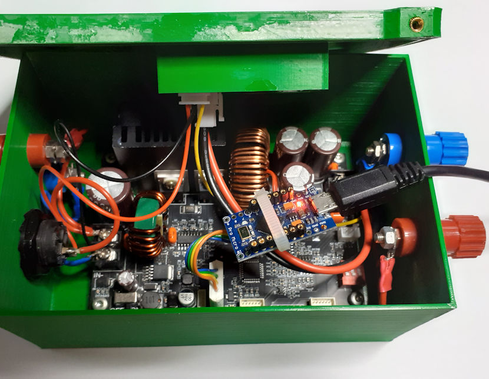
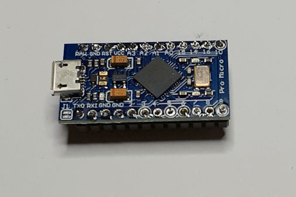
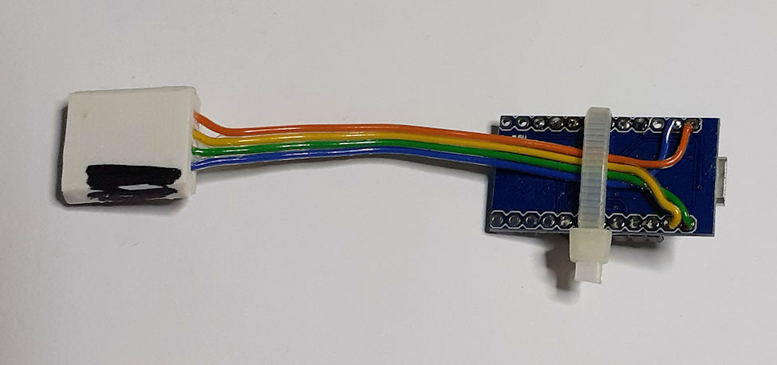
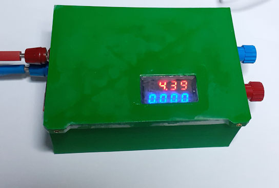
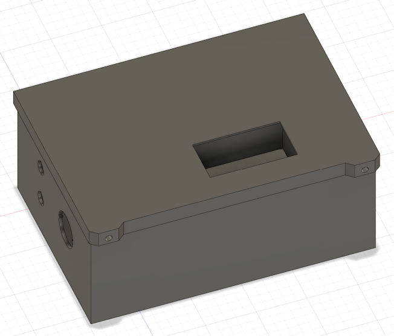

# xy6020l Library

UART control access to XY6020L DCDC converter board.

The library implements a simplified ModBus for the data link layer. With the provided functions it is easy to control the DCDC operation and use them as safe low voltage power supply for many applications. 

In combination with a small sized Arduino board, the XY6020L can be adapted to different applications, for example as a solar maximum power point tracker:

The library is tested with an  Arduino Pro Micro clone from China, but also other board shall work.

These devices provides 2 independent UART drivers. One for USB serial programming and debugging and the other one for the TX/RX pins. Together with the 5 V supply from the XY6020L you need only 4 wire to control the DCDC converters operation.

Special thanks to users: 
 - **g-radmac** on allaboutcircuits forum for his discovery of the UART protocol! 
 - **RikBen68** for informing me about the existing manual from [tinkering4fun](https://github.com/tinkering4fun/XY6020L-Modbus/tree/main) and the valuable improvement tips.
 - **tinkering4fun** for creation of the [manual](https://github.com/tinkering4fun/XY6020L-Modbus/blob/main/doc/XY6020L-Modbus-Interface.pdf)

## General

- No blocking program flow
- cached voltage and current set commands 
- automatic update of internal register from XY6020L

## References: 
- [Translation from chinese manual from user tinkering4fun](https://github.com/tinkering4fun/XY6020L-Modbus/blob/main/doc/XY6020L-Modbus-Interface.pdf)
- [@allaboutcircuits: Exploring programming a XY6020L power supply via modbus](https://forum.allaboutcircuits.com/threads/exploring-programming-a-xy6020l-power-supply-via-modbus.197022/)
- [Simply Modbus FAQ](https://www.simplymodbus.ca/FAQ.htm)

# Usage

## Data Access

The internal registers of the XY6020L are stored temporarily. Please use [this manual](https://github.com/tinkering4fun/XY6020L-Modbus/blob/main/doc/XY6020L-Modbus-Interface.pdf) as reference. 

**Read access:**

They are updated automatically on a cyclical basis or can be requested explicitly. 

**Write access:**

If the registers are to be changed, set methods are available. For the registers to be updated frequently, as
 - constant voltage: setCV( word cv)
 - constant current: setCC( word cc)
 - output state: setOutput(bool onState)
 - output lock: setLockOn(bool onState)
the write accesses are temporarily stored in a ring buffer so that no update is lost if the send buffer is still full.

**Data Type** 

The data type is kept the same as transfered from XY6020L. There is almost a scaling of 100 from the physical value is used.  

For example:
- a voltage of 10 V has a value of 1000 
- a current of 4.23 A has a value of 423

## No Blocking Code

The library does not use blocking code so that the programme flow is not stopped, thus enabling control loops. 
As the XY6020L requires up to 100 ms for responses, the receipt of requested data must be queried via polling. 

The content of the registers is queried for all registers at once using the **ReadAllHRegs()** method. If **HRegUpdated()** returns true, the contents are available in the buffer (hRegs) and can be read using get methods.

**Automatic Update of Holding Registers**

In addition to polling, all internal registers are automatically updated cyclically. This can be inhibited via the option switch **XY6020_OPT_NO_HREG_UPDATE** in the class constructor.

# Highlighed Functions

## Task Caller

- void task(void);

This function must be called cyclically in the loop() method. 

It controls the receipt and sending of messages and the cyclical updating of the registers.

**Example:**

    xy6020l xy(Serial1, 1);
    :
    void loop() 
    {
        xy.task();

wait till new data arrived and has been decoded

        if(xy.HRegUpdated())
        {

data access to internal buffer

            vIn = xy.getInV();
            :
            // do some calculations...
            :

This places the update CV register in the ring buffer and xy.task() will transmit it as soon as the send buffer is empty

            xy.setCV( vOut );
        }
    }

## Model & Version Number

The methods
- word getModel(void)
- word getVersion(void)
provides the result from the model and version register.

**Example for non-automatically update of Holding Registers:**

    xy6020l xy(Serial1, 0x01, 50, XY6020_OPT_SKIP_SAME_HREG_VALUE | XY6020_OPT_NO_HREG_UPDATE);

    void loop() {

Request to read all holding register so that model and version registers are read too:

        xy.ReadAllHRegs();

Call the XY6020L class driver as long as the reply is received and decoded:

        while(!xy.HRegUpdated())
            xy.task();

Write model and version numbers to the serial monitor of Arduino IDE

        sprintf( tmpBuf, "\nM:%04X V:%04X\n", xy.getModel(), xy.getVersion() );
        Serial.print(tmpBuf);
    }

**Output**

    M:6100 V:0074

## Preset Memory 

The XY6020L supports up to 10 preset memories, which set the constant voltage and current settings as well as protection values.
Changed presets only become active after a restart.

The following function allow an easy access to the preset settings:
- bool **setPreset**( word preset)
- void **SetMemory**(tMemory& mem)
- bool **GetMemory**(tMemory* pMem)
- void **PrintMemory**(tMemory& mem)

**Example of setting memory 2 as 12 V supply**

    xy6020l xy(Serial1, 0x01, 50, XY6020_OPT_SKIP_SAME_HREG_VALUE | XY6020_OPT_NO_HREG_UPDATE);
    :
    void loop() {
        xy.task();
        :

Set tMemory struct to 12 V output voltage and 5 A max current. At 10 V input supply, the XY6020L will switch off output.

        // 12 V supply
        Mem.Nr = 2;
        Mem.VSet = 1200;
        Mem.ISet =  500;
        Mem.sLVP = 1000;
        Mem.sOVP = 1300;
        Mem.sOCP =  620;
        Mem.sOPP = 1040;
        Mem.sOHPh= 0;
        Mem.sOHPm= 0;
        Mem.sOAH = 0;
        Mem.sOWH = 0;
        Mem.sOTP = 110;
        Mem.sINI = 0;
        xy.SetMemory(Mem);
        xy.PrintMemory(Mem);
        :
    }

**Output:**

    List Memory Content:
    Nr: 2 
    V-SET = 1200 (Voltage setting)
    I-SET = 500 (Current setting)
    S-LVP = 1000 (Low voltage protection value)
    S-OVP = 1300 (Overvoltage protection value)
    S-OCP = 620 (Overcurrent protection value)
    S-OPP = 1040 (Over power protection value)
    S-OHP_H = 0 (Maximum output time - hours)
    S-OHP_M = 0 (Maximum output time - minutes)
    S-OAH = 0 (Maximum output charge Ah)
    S-OWH = 0 (Maximum output energy Wh)
    S-OTP = 110 (Over temperature protection)
    S-INI = 0 (Power-on output switch)

# Example Applications

## Setup and read memory registers

**xySetup.ino**

- prints diagnosis via USB serial port
- prints model and version number
    
- sets °C as temperature unit
- writes 3 memory presets as example
- prints settings of all 10 memory

## Max Power Point tracker for solar driven electrolytic cell

**dcdcmbus.ino**

- Usage of XY6020L DCDC for simple max power point tracking of a solar module driving a electrolytic cell
- Cells voltage start from ~3 V and current will rise up to ~3A at 4 V.
- At ~19 V the 20V pannel has its maximum power.
- Simple I-controler increases the cell voltage till the power consumption from the solar panel drives its voltage below 19 V.
    
Hardware:  Arduino Pro Micro Clone from China

### Case Model for 3D printer

The water proof case hold on its top side a 4 digit U/A display, which can be switch off/on via a switch at the left side.

The models source is in folder Case3D as Fusion360 file as well as the top and button side of the case as STL file.

## copyrights:

Author: Jens Gleissberg
Date: 2024
License: GNU Lesser General Public License v3.0 or later
